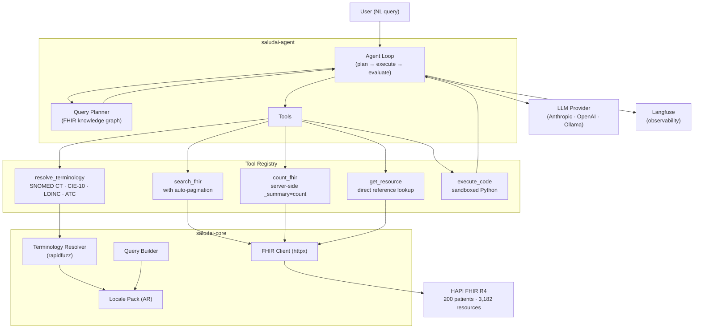

# SaludAI

**A benchmarked, traceable FHIR agent for Latin America** — measurable precision across 5 LLMs, every reasoning step auditable, designed for public health systems.

[](https://github.com/saludai-labs/saludai/actions/workflows/ci.yml)
[](LICENSE)
[-brightgreen)](docs/experiments/EXPERIMENTS.md)
[](https://python.org)
[](.github/workflows/ci.yml)
[](.github/workflows/ci.yml)

---

**Ask:** *"Pacientes con diabetes tipo 2 mayores de 60 en Buenos Aires"*

**Get:** A structured, sourced answer — with every reasoning step traced in Langfuse.

SaludAI translates clinical questions in natural language into FHIR R4 API calls, resolves medical terminology (SNOMED CT, CIE-10, LOINC, ATC), navigates multi-resource references, and returns traceable answers. Built and tested against Argentine synthetic data on HAPI FHIR. Designed to extend to other FHIR-compliant systems via locale packs.

## Multi-LLM Benchmark

Evaluated on **100 questions** across **200 synthetic Argentine patients** (3,182 FHIR resources, 10 resource types). Inspired by [FHIR-AgentBench](https://arxiv.org/abs/2509.19319) (Verily/KAIST/MIT).

| Model | Accuracy | Simple (16) | Medium (41) | Complex (43) | Errors* | P50 Latency |
|-------|----------|-------------|-------------|--------------|---------|-------------|
| **Claude Sonnet 4.5** | **84.0%** | 94% | 93% | 72% | 8 | 12.7s |
| Claude Haiku 4.5 | 77.0% | 100% | 80% | 65% | 7 | 6.6s |
| GPT-4o | 63.0% | 100% | 73% | 40% | 3 | 14.4s |
| Llama 3.3 70B | 48.0% | 94% | 63% | 16% | 9 | 6.5s |
| Qwen 3.5 9B | 25.0% | 50% | 29% | 12% | 1 | 11.8s |

*\*Errors = agent exceeded iteration budget (8 steps) and could not produce an answer. These count as incorrect in the accuracy score.*

*All models use the same agent loop, tools, and system prompt. Differences reflect reasoning ability, tool calling reliability, and schema handling. Questions cover terminology resolution, multi-hop reference traversal, server-side counting, aggregation, and temporal filtering across 10 FHIR resource types. Evaluated on synthetic data — not validated in clinical environments. See [experiment log](docs/experiments/EXPERIMENTS.md) for detailed methodology and per-question analysis.*

## Architecture



**Key design decisions:**

- **No LangChain.** The agent loop is ~300 lines of Python. Every step is auditable and traceable. We chose simplicity over framework magic — see [ADR-002](docs/decisions/).
- **Hybrid Query Planner.** A plan-and-execute pattern with a FHIR knowledge graph (resource relationships + query pattern catalog). The planner classifies the question and selects a strategy *before* the agent starts calling tools — see [ADR-009](docs/decisions/009-hybrid-query-planner.md).
- **Action Space Reduction.** Instead of suggesting tools via prompt, we *remove* irrelevant tools from the LLM's context based on the query plan. The model can't misuse what it can't see.
- **Provider-agnostic.** Same agent loop works with Claude, GPT-4o, Llama, or Qwen. Swap the model, keep everything else.

## Quick Start

```bash
# Clone and install
git clone https://github.com/saludai-labs/saludai.git
cd saludai
uv sync

# Start HAPI FHIR with 200 synthetic Argentine patients
docker compose up -d

# Wait ~30s for seeding, then verify
curl http://localhost:8890/fhir/Patient?_summary=count

# Run the agent
uv run saludai query "¿Cuántos pacientes tienen diabetes tipo 2?"

# Run the benchmark
uv run python -m benchmarks.run_eval

# Run tests (696 tests, 95% coverage)
uv run pytest
```

**Prerequisites:** [Python 3.12+](https://python.org), [UV](https://docs.astral.sh/uv/), [Docker](https://docs.docker.com/get-docker/)

## Usage

### MCP Server (Claude Desktop / Claude Code / Cursor)

SaludAI exposes its tools via the [Model Context Protocol](https://modelcontextprotocol.io):

```bash
# Start MCP server (stdio transport)
uv run saludai-mcp
```

Add to your MCP client config (`claude_desktop_config.json`):

```json
{
  "mcpServers": {
    "saludai": {
      "command": "uv",
      "args": ["run", "--directory", "/path/to/saludai", "saludai-mcp"],
      "env": {
        "SALUDAI_FHIR_SERVER_URL": "http://localhost:8890/fhir"
      }
    }
  }
}
```

### REST API

```bash
uv run saludai serve
# POST http://localhost:8000/query {"query": "Pacientes con hipertensión en Córdoba"}
```

### CLI

```bash
uv run saludai query "Medicaciones más frecuentes en pacientes mayores de 70"
```

## Project Structure

```
saludai/
├── packages/
│   ├── saludai-core/       # FHIR client, terminology resolver, query builder, locale packs
│   ├── saludai-agent/      # Agent loop, planner, tools, LLM abstraction
│   ├── saludai-mcp/        # MCP server (Claude Desktop, Cursor, etc.)
│   └── saludai-api/        # FastAPI REST interface
├── benchmarks/             # 100-question eval framework + results
├── data/seed/              # Deterministic synthetic data generator (200 AR patients)
├── notebooks/              # Interactive Jupyter demos (3 notebooks)
└── docs/                   # Architecture, ADRs, experiments, roadmap
```

## Built for Latin America

SaludAI is not a generic FHIR wrapper with Spanish translations bolted on. It's built for Argentina's health system, with an architecture designed to scale across Latin America:

- **Argentine terminology:** SNOMED CT Argentine edition, CIE-10 (Argentine adaptation), LOINC, ATC — with fuzzy matching via rapidfuzz
- **Locale packs:** Country-specific bundles of terminology, system prompts, and FHIR metadata. Argentina ships built-in; add your country by implementing a locale pack
- **openRSD-aware:** Locale pack references Argentina's national FHIR profiles
- **Synthetic data that looks real:** 200 patients with Argentine names, DNI, 18 provinces weighted by population
- **Spanish-first prompts:** The agent reasons in the language of the data

```python
from saludai_core.locales import load_locale_pack

pack = load_locale_pack("ar")  # SNOMED CT AR + CIE-10 AR + LOINC + ATC
```

## Observability

Every agent run is fully traced in [Langfuse](https://langfuse.com):

- Query plan generation (planner output)
- Each iteration: LLM call, tool selection, tool execution, result
- Token usage and cost per step
- Final answer with evaluation score

Set up Langfuse Cloud (free tier) or self-hosted:

```bash
export LANGFUSE_PUBLIC_KEY=pk-...
export LANGFUSE_SECRET_KEY=sk-...
export LANGFUSE_HOST=https://cloud.langfuse.com
```

## Notebooks

| Notebook | Description |
|----------|-------------|
| [01-getting-started](notebooks/01-getting-started.ipynb) | FHIR client, terminology resolver, query builder |
| [02-agent-queries](notebooks/02-agent-queries.ipynb) | Natural language queries with the agent loop |
| [03-benchmark-eval](notebooks/03-benchmark-eval.ipynb) | Run and analyze the FHIR-AgentBench evaluation |

## Contributing

Contributions are welcome! See [CONTRIBUTING.md](CONTRIBUTING.md) for development setup, code style, and PR guidelines.

## License

Apache 2.0 — see [LICENSE](LICENSE) for details.
